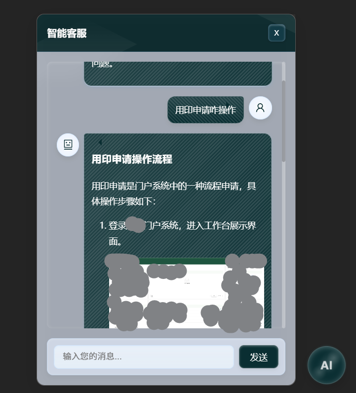

# AI悬浮球组件使用文档

## 简介

AI悬浮球是一个React组件，可以在网页上添加一个可拖动的AI聊天助手悬浮球。用户可以通过点击悬浮球打开对话框，与AI助手进行交流。此组件支持自定义位置、图标、API接口、系统提示词、markdown格式等功能。



## 安装

```bash
npm install ai-float-ball --save
```

## 基本用法

```tsx
import { FloatingBall } from 'ai-float-ball';

function App() {
  // 创建配置对象
  const floatBallConfig = {
    apiUrl: 'https://api.example.com/v1/chat/completions', // 替换为您的API地址
    apiKey: 'your-api-key',                              // 替换为您的API密钥
    model: 'gpt-3.5-turbo',                              // 替换为您使用的模型名称
    systemPrompt: '你是一个ai助手，图片以这种方式输出 如果有相关图片的话尽量要带，但一定要进行格式转换，注意千万不要输出这种的md的图片格式，要用img标签的方式输出图片，例如就是 文件名一定要保持一致！。 ',
    docPath: '/docs/manual.md',                           // 替换为您的文档路径
    title: '客户服务助手',                               // 设置对话框标题
    welcomeMessage: '您好！请问有什么可以帮助您的吗？'   // 设置初始问候语
  };

  return (
    <FloatingBall config={floatBallConfig} />
  );
}

export default App;
```

## 配置参数

`FloatingBall` 组件接受一个配置对象，包含以下参数：

### 必填参数

| 参数名 | 类型 | 描述 |
|--------|------|------|
| apiUrl | string | API接口地址，用于发送聊天请求 |
| apiKey | string | API密钥，用于API认证 |
| model | string | 使用的模型名称，例如："gpt-3.5-turbo"、"claude-3-7-sonnet" 等 |
| systemPrompt | string | 系统提示词，用于指导AI如何回答问题 |
| docPath | string | 文档路径，用于加载系统知识库（只能是md格式） |

### 可选参数

| 参数名 | 类型 | 默认值 | 描述 |
|--------|------|--------|------|
| title | string | "智能客服" | 对话框标题文本 |
| welcomeMessage | string | "我是您的智能AI助手，请问有什么可以帮到您？我可以回答关于系统功能和使用方法的问题。" | AI的第一句问候语 |
| headers | Record<string, string> | undefined | 自定义请求头 |
| position | { x: number; y: number } | { x: window.innerWidth - 80, y: window.innerHeight - 80 } | 悬浮球的初始位置 |
| markedOptions | MarkedOptions | undefined | Markdown渲染配置，使用marked库的原生类型 |
| customIcons | { ball?: React.ReactNode; user?: React.ReactNode; ai?: React.ReactNode } | undefined | 自定义图标组件 |
| maxHistoryLength | number | 20 | 最大历史消息数量 |

## 高级用法

### 自定义对话框标题和初始问候语

您可以通过配置`title`和`welcomeMessage`参数来自定义对话框标题和AI的第一句问候语：

```tsx
const floatBallConfig = {
  // 其他配置...
  title: '智能客服小助手', // 自定义对话框标题
  welcomeMessage: '您好！我是AI客服小助手，很高兴为您服务。请问有什么需要帮助的吗？' // 自定义初始问候语
};
```

### 自定义图标

您可以自定义悬浮球、用户头像和AI头像的图标：

```tsx
import { FloatingBall } from 'ai-float-ball';
import { UserOutlined, RobotOutlined } from '@ant-design/icons';

function App() {
  const floatBallConfig = {
    // 基础配置
    apiUrl: 'https://api.example.com/v1/chat/completions',
    apiKey: 'your-api-key',
    model: 'gpt-3.5-turbo',
    systemPrompt: '你是一个AI助手',
    docPath: '/docs/manual.md',
    
    // 自定义图标
    customIcons: {
      ball: <div style={{ fontSize: '24px', color: '#1890ff' }}>AI</div>,
      user: <UserOutlined style={{ fontSize: '20px' }} />,
      ai: <RobotOutlined style={{ fontSize: '20px', color: '#1890ff' }} />
    }
  };

  return (
    <FloatingBall config={floatBallConfig} />
  );
}
```

### 自定义系统提示词

系统提示词用于引导AI如何回答用户问题。您可以根据需要自定义提示词：

```tsx
const floatBallConfig = {
  // 其他配置...
  systemPrompt: `你是一个有用的AI智能客服，名叫小谦。请基于以下系统文档知识库来回答用户的问题。
回答时要简洁明了，如果用户的问题与系统功能相关，请根据知识库内容回答。
输出格式需要是简化的md格式，只允许使用**加粗**和换行，不要使用标题(#)、列表、缩进等其他markdown语法。
如果问题不在知识库范围内，就用你自己的知识回答，并注明这是你的建议而非系统官方信息。`
};
```

### 自定义Markdown渲染选项

组件使用marked库来渲染Markdown内容，您可以自定义渲染选项：

```tsx
const floatBallConfig = {
  // 其他配置...
  markedOptions: {
    breaks: true,        // 允许换行
    gfm: true,           // 使用GitHub风格的Markdown
    headerIds: false,    // 不为标题生成ID
    // 其他marked选项...
  }
};
```

## 注意事项

1. 确保配置中的`apiUrl`和`apiKey`是正确的

2. 需要确保API支持流式响应，并按照组件期望的格式返回数据

3. 文档路径`docPath`应指向一个有效的Markdown文档，用于AI知识库

## 常见问题

### Q: 如何调整悬浮球的大小？
A: 悬浮球的大小通过CSS控制，您可以覆盖`.floating-ball`类的样式来自定义大小。

### Q: 如何更改聊天窗口的标题？
A: 可以通过配置对象中的`title`参数来设置聊天窗口的标题，例如：`title: '客户服务中心'`。

### Q: 支持哪些AI模型？
A: 组件设计上支持任何符合OpenAI API格式的模型，包括但不限于GPT系列、Claude系列等。

### Q: 如何处理大量消息的性能问题？
A: 组件内置了`maxHistoryLength`参数，默认限制历史消息数量为20条，您可以根据需要调整此参数来平衡性能和上下文长度。

